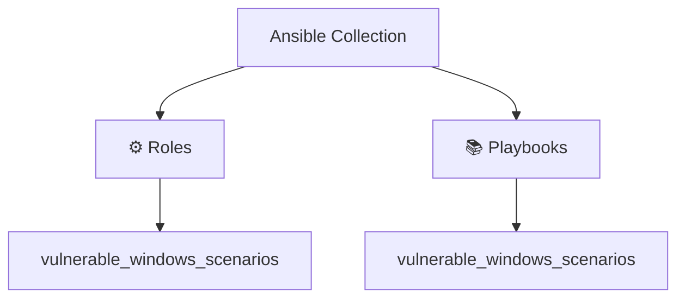

# Ansible Collection: Dumpsterfire

[](https://github.com/l50/ansible-collection-dumpsterfire/blob/main/LICENSE)
[](https://github.com/l50/ansible-collection-dumpsterfire/actions/workflows/pre-commit.yaml)
[](https://github.com/l50/ansible-collection-dumpsterfire/actions/workflows/molecule.yaml)
[](https://github.com/l50/ansible-collection-dumpsterfire/actions/workflows/renovate.yaml)

This Ansible collection provides automated deployment of vulnerable scenarios
for security testing, training, and research purposes.

## Architecture Diagram



## Requirements

- Ansible 2.15 or higher
- Windows target host(s)

## Installation

Install the collection from Ansible Galaxy:

```bash
ansible-galaxy collection install git+https://github.com/l50/ansible-collection-dumpsterfire.git,main
```

## Roles

### Vulnerable Windows Scenarios

Sets up configurable vulnerable Windows system with:

- Misconfigured user permissions
- Exposed network shares
- Sensitive documents
- Common Windows security misconfigurations

The role creates realistic scenarios commonly found in enterprise environments,
perfect for:

- Security training and workshops
- Penetration testing practice
- Red team training
- Security tool testing

## Usage

Include the role in your playbook:

```yaml
---
- name: Deploy vulnerable Windows scenario
  hosts: windows_targets
  roles:
    - l50.dumpsterfire.vulnerable_windows_scenarios
```

## Directory Structure

```bash
.
├── roles
│   └── vulnerable_windows_scenarios
│       ├── files
│       │   └── attorney_client_privileged_intellectual_property.txt
│       ├── tasks
│       │   ├── documents.yml
│       │   ├── main.yml
│       │   ├── shares.yml
│       │   └── users.yml
│       ├── templates
│       │   └── welcome.txt.j2
│       └── vars
│           └── main.yml
```

## License

This collection is licensed under the MIT License - see the [LICENSE](LICENSE)
file for details.

## Support

- Repository: [l50/ansible-collection-dumpsterfire](http://github.com/l50/ansible-collection-dumpsterfire)
- Issue Tracker: [GitHub Issues](https://github.com/l50/ansible-collection-dumpsterfire/issues)

## Warning

This collection creates intentionally vulnerable system configurations. Only
deploy these scenarios in controlled, isolated environments intended for
security testing and training.

## Authors

- Jayson Grace ([techvomit.net](https://techvomit.net))
